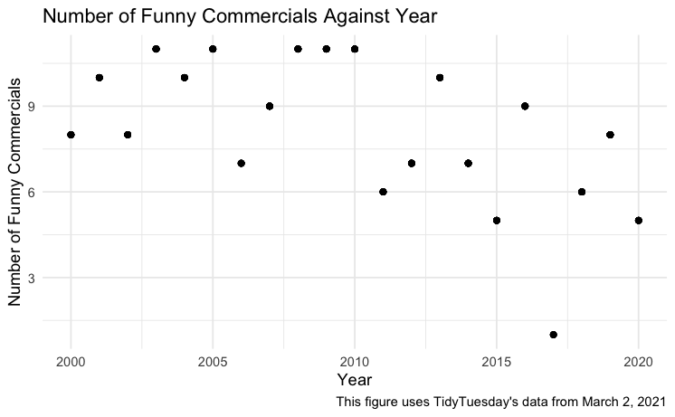
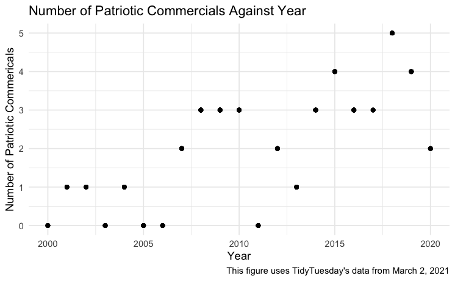
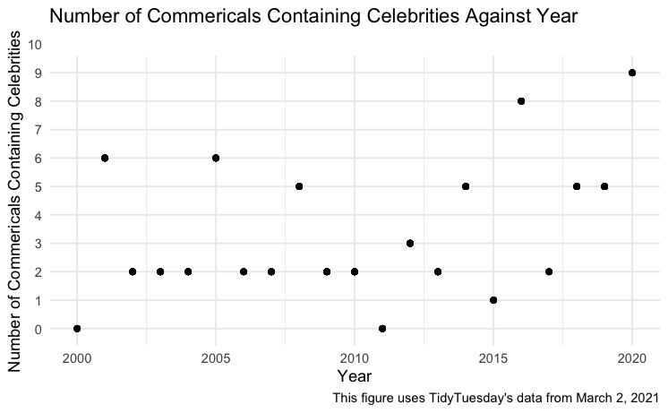

```{r setup, include=FALSE}
knitr::opts_chunk$set(echo = TRUE)
```

# Loading the necessary packages 
```{r, message=FALSE}
library(tidyverse)
```

# Getting TidyTuesday data from https://github.com/rfordatascience/tidytuesday 

I got the data from https://github.com/rfordatascience/tidytuesday, particularly from https://github.com/rfordatascience/tidytuesday/tree/master/data/2021/2021-03-02
(from the section titled "Get the data here"). This week's data is about Superbowl commercials. 

```{r}
tuesdata <- tidytuesdayR::tt_load('2021-03-02')

youtube <- tuesdata$youtube
```

# Let's get started! 

```{r}
youtube %>% 
  group_by(year) %>%
  mutate(num_funny_ads = sum(funny)) %>%
  ggplot(aes(x = year, y = num_funny_ads)) + 
  geom_point() +
  labs(
    title = "Number of Funny Commercials Against Year",
    x = "Year", 
    y = "Number of Funny Commercials",
    caption = "This figure uses TidyTuesday's data from March 2, 2021"
  ) + 
  theme_minimal()

```



From the scatterplot, It is clear that 2017's Superbowl had the least number of funny commercials. Also, there seems to be a weak negative correlation between year and number of funny commercials. 

```{r}
youtube %>% 
  group_by(year) %>%
  mutate(num_patriotic_ads = sum(patriotic)) %>%
  ggplot(aes(x = year, y = num_patriotic_ads)) +
  geom_point() +
  labs(
    title = "Number of Patriotic Commercials Against Year",
    x = "Year",
    y = "Number of Patriotic Commericals",
    caption = "This figure uses TidyTuesday's data from March 2, 2021"
  ) +
  theme_minimal()
```



From the scatterplot, it is evident that 2018's Superbowl had the most patriotic commercials. Also, there seems to be a weak positive correlation between year and number of patriotic commericals. 

```{r, warning = FALSE}
youtube %>% 
  group_by(year) %>% 
  mutate(num_ads_with_celebrities = sum(celebrity)) %>%
  ggplot(aes(x = year, y = num_ads_with_celebrities)) + 
  geom_point() + 
  labs(
    x = "Year", 
    y = "Number of Commericals Containing Celebrities", 
    title = "Number of Commericals Containing Celebrities Against Year
    ", 
    caption = "This figure uses TidyTuesday's data from March 2, 2021"
  ) + 
  theme_minimal() + 
  scale_y_discrete(limits = 0:10)
  
```



From this graph, it is clear that 2020's Superbowl had the most commercials containing celebrities. 
