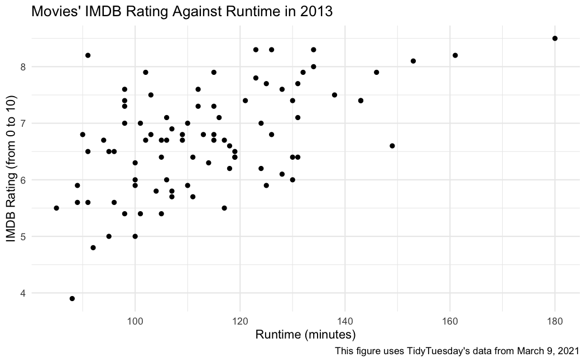
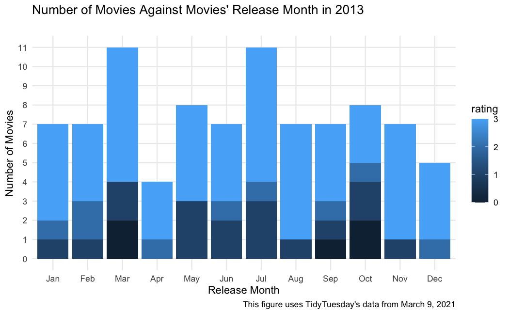

# Loading the necessary packages 

```r
library(tidyverse)
```

# Getting TidyTuesday data from https://github.com/rfordatascience/tidytuesday 

I got the data from https://github.com/rfordatascience/tidytuesday, particularly from https://github.com/rfordatascience/tidytuesday/tree/master/data/2021/2021-03-09
(from the section titled "Get the data here"). This week's data is about Bechdel Test. 


```r
tuesdata <- tidytuesdayR::tt_load('2021-03-09')
```

```
## --- Compiling #TidyTuesday Information for 2021-03-09 ----
```

```
## --- There are 2 files available ---
```

```
## --- Starting Download ---
```

```
## 
## 	Downloading file 1 of 2: `raw_bechdel.csv`
## 	Downloading file 2 of 2: `movies.csv`
```

```
## --- Download complete ---
```

```r
bechdel <- tuesdata$raw_bechdel
movies <- tuesdata$movies
```

Important Note: `bechdel` contains data from 1970-2020 and `movies` contains data from 1970-2013 (as noted in https://github.com/rfordatascience/tidytuesday/tree/master/data/2021/2021-03-09 above the "Get the data here" section). 

# Let's get started! 


```r
bechdel_2013 <- bechdel %>% 
  filter(year == 2013)

movies_2013 <- movies %>%
  filter(year == 2013)

bechdel_movies_2013 <- bechdel_2013 %>%
  inner_join(movies_2013, by = "imdb_id")

dim(bechdel_movies_2013)
```

```
## [1] 99 38
```

For this TidyTuesday project, I will only focus on the year 2013 since the dataset `movies` only contains data until 2013. Since the two datasets (`bechdel` and `movies`) have the variable 'imdb_id' in common, then these datasets will be joined by this particular variable. In fact, an inner join was used in order to include all the rows that are in `bechdel_2013` **and** `movies_2013`. 

# Data Visualization 1: 


```r
runtime_imdb_rating_2013 <- bechdel_movies_2013 %>%
  select(c(runtime, imdb_rating)) %>%
  mutate(runtime = str_replace(runtime, " min", "")) %>%
  mutate(runtime = as.numeric(runtime)) %>%
  filter(!is.na(runtime) | !is.na(imdb_rating))
```

After selecting each movie's `runtime` and `imdb_rating`, cleaning the data, and removing the NA values, there are 89 films that `bechdel_2013` and `movies_2013` have in common in the year 2013. 


```r
runtime_imdb_rating_2013 %>%
  ggplot(aes(x = runtime, y = imdb_rating)) +
  geom_point() + 
  theme_minimal() + 
  labs(
    title = "Movies' IMDB Rating Against Runtime in 2013",
    x = "Runtime (minutes)", 
    y = "IMDB Rating (from 0 to 10)",
    caption = "This figure uses TidyTuesday's data from March 9, 2021"
  )
```

<!-- -->


From this scatterplot, it is clear that there is a positive correlation between movies' runtime in minutes and their IMDB rating, which goes from 0 to 10. In fact, it seems like the minimum IMDB rating in 2013 was approximatedly 4. Additionally, the maximum IMDB rating in 2013 was 8.5 which corresponds to a movie that was 180 minutes long. 

# Data Visualization 2: 


```r
release_month_bechdel_rating_2013 <- bechdel_movies_2013 %>%
  select(c(released, rating)) %>%
  filter(!is.na(released)) %>%
  filter(!is.na(rating)) %>%
  mutate(released = str_remove(released, "\\d+\\s")) %>% 
  mutate(released = str_remove(released, "\\s\\d+$")) 
```

In this case, I selected each movie's `released` date and Bechdel's `rating` which goes from 0 to 3. In fact, the description for the variable `rating` is the following: "Rating (0-3), 0 = unscored, 1. It has to have at least two [named] women in it, 2. Who talk to each other, 3. About something besides a man"
(as noted in https://github.com/rfordatascience/tidytuesday/tree/master/data/2021/2021-03-09 under the Data Dictionary section). After selecting these specific variables, I cleaned the data by not including NA values and by setting `released` date to only contain the month. As a result, there are 89 movies that the datasets `bechdel_2013` and `movies_2013` have in common in the year 2013. 


```r
release_month_bechdel_rating_2013 %>%
  count(released, rating) %>% 
  mutate(released = fct_relevel(released, "Dec", after=11)) %>%
  mutate(released = fct_relevel(released, "Nov", after=10)) %>%
  mutate(released = fct_relevel(released, "Oct", after=9)) %>%
  mutate(released = fct_relevel(released, "Sept", after=8)) %>%
  mutate(released = fct_relevel(released, "Aug", after=7)) %>%
  mutate(released = fct_relevel(released, "Jul", after=6)) %>%
  mutate(released = fct_relevel(released, "Jun", after=5)) %>%
  mutate(released = fct_relevel(released, "May", after=4)) %>%
  mutate(released = fct_relevel(released, "Apr", after=3)) %>%
  mutate(released = fct_relevel(released, "Mar", after=2)) %>%
  mutate(released = fct_relevel(released, "Feb", after=1)) %>%
  mutate(released = fct_relevel(released, "Jan", after=0)) %>%
  ggplot(aes(x = released, y = n, fill = rating)) + 
  geom_bar(stat = "identity") + 
  labs(
    title = "Number of Movies Against Movies' Release Month in 2013
    ",
    x = "Release Month", 
    y = "Number of Movies",
    caption = "This figure uses TidyTuesday's data from March 9, 2021"
  ) + 
  theme_minimal() + 
  scale_y_discrete(limits = 0:11) 
```

```
## Warning: Problem with `mutate()` input `released`.
## ℹ Unknown levels in `f`: Sept
## ℹ Input `released` is `fct_relevel(released, "Sept", after = 8)`.
```

```
## Warning: Unknown levels in `f`: Sept
```

```
## Warning: Continuous limits supplied to discrete scale.
## Did you mean `limits = factor(...)` or `scale_*_continuous()`?
```

<!-- -->


From this graph, it is clear that March and July are the months in which more movies were released. In addition, it is evident that April and December are the months in which the less movies were released; nevertheless, these films only have high ratings since these two months only have light blue colors in their bars. That being said, March, September and October are the only months that have a shade of blue which corresponds to ratings near 0, which means 'unscored'.  
